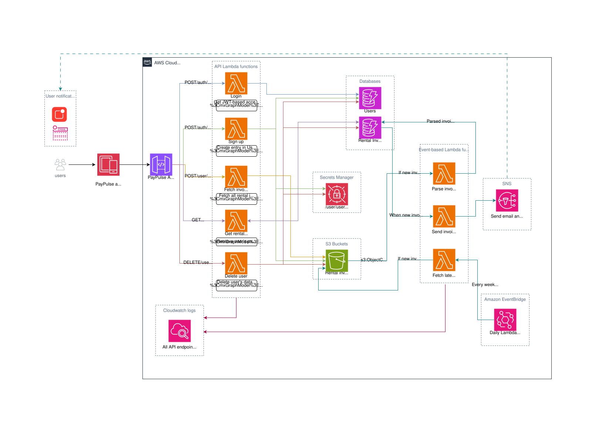

# PayPulse-Cloud
This repository contains the Cloud backend for the PayPulse app. The backend for this app is developed in AWS and maintained using Terraform.

PayPulse is an iOS app that fetches both rental and retail invoices from a Gmail inbox using OAuth 2.0 authentication, parses them, and presents invoice information and statistics. 
The GitHub link to the PayPulse app can be found [here](https://github.com/azfar-imtiaz/PayPulse).

## Cloud Architecture Diagram


## Project Structure
```
.
├── lambdas
│   ├── invoices
│       ├── fetch_invoices	
│           ├── lambda_function.py
│           ├── requirements.txt
│       ├── fetch_latest_invoice
│           ├── main.py
│           ├── requirements.txt
│       ├── parse_invoice
│           ├── src
│               ├── HyresaviParser.py
│               ├── lambda_function.py
│               ├── logging_config.py
│           ├── Dockerfile
│           ├── event.json
│           ├── requirements.txt
│       ├── get_rental_invoice
│           ├── main.py
│           ├── requirements.txt
│       ├── get_rental_invoices
│           ├── main.py
│           ├── requirements.txt
│       ├── send_invoice_notification
│           ├── main.py
│           ├── requirements.txt
│       ├── fetch_retail_invoices
│           ├── lambda_function.py
│           ├── requirements.txt
│   ├── users
│       ├── login_user
│           ├── main.py
│           ├── requirements.txt
│       ├── signup_user
│           ├── main.py
│           ├── requirements.txt
│       ├── get_user_profile
│           ├── main.py
│           ├── requirements.txt
│       ├── delete_user
│           ├── main.py
│           ├── requirements.txt
│   ├── auth
│       ├── gmail_store_tokens
│           ├── main.py
│           ├── requirements.txt
├── lambda_layers
│   ├── common
│       ├── python
│           ├── utils
│               ├── __init__.py
│               ├── auth_utils.py
│               ├── dynamodb_utils.py
│               ├── jwt_utils.py
│               ├── s3_utils.py
│               ├── secretsmanager_utils.py
│               ├── utility_functions.py
│               ├── error_handling.py
│               ├── responses.py
│               ├── exceptions.py
│               ├── oauth_utils.py
│               ├── gmail_api_utils.py
│   ├── jwt
│       ├── python
│           ├── jwt
│               ├── ... jwt package Python scripts
├── aws-infra-terraform
│   ├── main.tf			            # Root module definition with IAM and Lambda modules
│   ├── variables.tf		            # Global input variables
│   ├── outputs.tf                          # Global outputs
│   ├── terraform.tfvars		    # Private secret values (gitignored)
│   ├── moved.tf                            # Resource state migration configuration
│   ├── secrets.tf			    # AWS Secrets Manager resources
│   ├── dynamodb.tf			    # DynamoDB tables
│   ├── dynamodb_autoscaling.tf		    # DynamoDB autoscaling configuration
│   ├── sns.tf                   	    # SNS topic for notifications
│   ├── cloudwatch.tf            	    # CloudWatch log group definitions
│   ├── cognito.tf               	    # Cognito identity pool
│   ├── eventbridge.tf           	    # Scheduled EventBridge trigger
│   ├── api_gateway.tf           	    # API Gateway configuration for all endpoints
│   ├── s3.tf                              # S3 buckets and notifications
│   ├── iam/                               # IAM module (organized by resource type)
│   │   ├── main.tf                        # IAM module configuration
│   │   ├── variables.tf                   # IAM module input variables
│   │   ├── outputs.tf                     # IAM role ARNs and outputs
│   │   ├── iam.tf                         # Main IAM resources (users, groups, roles)
│   │   ├── iam_signup_lambda.tf           # IAM role and policy for signup lambda
│   │   ├── iam_login_lambda.tf            # IAM role and policy for login lambda
│   │   ├── iam_delete_user_lambda.tf      # IAM role and policy for delete user lambda
│   │   ├── iam_get_rental_invoice_lambda.tf     # IAM role and policy for get rental invoice lambda
│   │   ├── iam_get_rental_invoices_lambda.tf    # IAM role and policy for get rental invoices lambda
│   │   ├── iam_get_user_profile_lambda.tf       # IAM role and policy for get user profile lambda
│   │   └── iam_gmail_store_tokens_lambda.tf     # IAM role and policy for gmail store tokens lambda
│   ├── lambdas/                           # Lambda functions module (organized by function)
│   │   ├── main.tf                        # Lambda module configuration
│   │   ├── variables.tf                   # Lambda module input variables  
│   │   ├── outputs.tf                     # Lambda function names, ARNs, and layers
│   │   ├── lambda_fetch_invoices.tf       # Fetch invoices lambda function
│   │   ├── lambda_fetch_latest_invoice.tf # Fetch latest invoice lambda function
│   │   ├── lambda_parse_invoice.tf        # Parse invoice lambda function
│   │   ├── lambda_send_invoice_notification.tf  # Send notification lambda function
│   │   ├── lambda_signup_user.tf          # User signup lambda function
│   │   ├── lambda_login_user.tf           # User login lambda function
│   │   ├── lambda_delete_user.tf          # Delete user lambda function
│   │   ├── lambda_get_rental_invoices.tf  # Get rental invoices lambda function
│   │   ├── lambda_get_rental_invoice.tf   # Get rental invoice lambda function
│   │   ├── lambda_get_user_profile.tf     # Get user profile lambda function
│   │   ├── lambda_gmail_store_tokens.tf   # Gmail store tokens lambda function
│   │   ├── lambda_fetch_retail_invoices.tf # Fetch retail invoices lambda function
│   │   └── lambda_layers.tf               # Lambda layers (utils, JWT, bcrypt, Google API)
│   └── terraform.tfstate        	    # Terraform state file (not in repo)
└── README.md                	            # You're here!
```

## Getting Started

#### Initialize Terraform 

```
terraform init
```

#### Check changes
```
terraform plan
```

#### Apply changes
```
terraform apply
```

## Infrastructure Overview

### Terraform Architecture

The infrastructure uses a modular Terraform approach for better organization and maintainability.

#### Root Module (`aws-infra-terraform/`)
- **main.tf**: Orchestrates the entire infrastructure by calling IAM and Lambda modules
- **variables.tf**: Global variables shared across all modules
- **outputs.tf**: Infrastructure outputs for external consumption
- **moved.tf**: Handles state migration when resources are moved between modules

#### IAM Module (`aws-infra-terraform/iam/`)
- **Purpose**: Centralized IAM management (roles, policies, users, groups)
- **Organization**: Each Lambda function has its own IAM configuration file

#### Lambda Module (`aws-infra-terraform/lambdas/`)
- **Purpose**: All Lambda function definitions and related resources
- **Organization**: Each Lambda function has its own configuration file

### S3 Bucket
This infrastructure consists of two S3 buckets:

#### - Rental invoices bucket

This bucket contains both rental and retail invoices that are fetched from the email inbox and uploaded. The path to the invoices is structured like this:

**Rental invoices (PDF):**
```
rental-invoices-bucket/invoices/user_id/rental/invoice_0001.pdf
```

**Retail invoices (HTML):**
```
rental-invoices-bucket/invoices/user_id/retail/{sub_type}/{vendor}_{date}_{hash}.html
```

Where `{sub_type}` can be:
- `food-delivery` - Restaurant and food delivery orders
- `clothing` - Clothing and fashion purchases
- `technology` - Electronics and tech products
- `subscriptions` - Streaming services, memberships, etc.
- `grocery` - Grocery store purchases
- `utility` - Utility bills (electricity, water, etc.)
- `miscellaneous` - Other retail purchases
- `travel` - Transportation invoices (flights, trains, buses, etc.)

Here, the user ID is generated dynamically, which happens when a user signs up. The user ID is a UUID prefixed with `user_`.

#### - Lambda functions bucket

This bucket is for containing the source code of the following lambda functions:
- Ingest all rental invoices
- Ingest latest rental invoice
- Ingest retail invoices
- Send invoice notification
- Get invoice
- Get invoices
- Delete user
- Get user profile
- Login
- Signup
- Store Gmail tokens

The source code of these lambda functions is uploaded as zipped files to this bucket. 
Everytime there is a change to any of these functions, a new version of their zipped file will be uploaded to this S3 bucket. 
That's how these lambda functions are deployed.

### Lambda Functions

There are several lambda functions, and some of them are linked, in a way. The execution of one triggers a chain of events.

|         Function          |        Function name        | Trigger | Description                                                                                                              | Deployment |
|:-------------------------:|:---------------------------:| :-------: |--------------------------------------------------------------------------------------------------------------------------| ------- |
|           Login           |        `login_user`         | API Gateway | This function allows an existing user to login, and returns an access token                                              | Zip upload to S3 bucket |
|          Sign up          |        `signup_user`        | API Gateway | This function allows a new user to sign up to PayPulse                                                                   | Zip upload to S3 bucket |
|       Get user profile    |     `get_user_profile`      | API Gateway | This function retrieves the user profile information (name, email, created date, Gmail connection status) for the authenticated user             | Zip upload to S3 bucket |
|    Store Gmail tokens     |   `gmail_store_tokens`      | API Gateway | This function stores OAuth 2.0 tokens received from iOS app for Gmail API access                                        | Zip upload to S3 bucket |
|    Ingest all rental invoices    |      `fetch_invoices`       | API Gateway | This function fetches all rental invoices (PDF) from the email inbox                                                           | Zip upload to S3 bucket |
|   Ingest latest rental invoice   |   `fetch_latest_invoice`    | EventBridge (every weekday 8:30 AM) | This function fetches the rental invoice for the current month, if available                                             | Zip upload to S3 bucket |
|    Ingest retail invoices    |   `fetch_retail_invoices`   | API Gateway | This function fetches retail invoices (HTML) from Gmail based on active vendor configurations. Supports custom date ranges                                        | Zip upload to S3 bucket |
|       Parse invoice       |       `parse_invoice`       | S3 (rental invoice upload) | This function parses a rental invoice PDF and stores the information in DynamoDB                                             | Docker image pushed to ECR repository |
|        Get invoice        |    `get_rental_invoice`     | API Gateway | This function retrieves the full invoice details for a given invoice ID. **This is not being used in the app right now** | Zip upload to S3 bucket |
|       Get invoices        |    `get_rental_invoices`    | API Gateway | This function retrieves and returns all rental invoices for a logged-in user                                                    | Zip upload to S3 bucket |
|        Delete user        |        `delete_user`        | API Gateway | This function deletes all data for a given user in PayPulse Cloud                                                        | Zip upload to S3 bucket |
| Send invoice notification | `send_invoice_notification` | DynamoDB stream | This function sends an email and iOS notification everytime a new rental invoice is parsed                               | Zip upload to S3 bucket |

1. The `fetch_latest_invoice` function is triggered once every weekday in the morning. It uses OAuth 2.0 tokens stored in AWS Secrets Manager to access the user's Gmail inbox via Gmail API, checking for the latest rental invoice for the current month. If it finds such an invoice and there's no corresponding record in the DynamoDB table, it uploads it to a specific path in the rental invoices S3 bucket. 
2. This triggers the `parse_invoice` function, which downloads this rental invoice, parses the relevant information from it, and uploads it to the DynamoDB table containing the data of parsed invoices.
3. This triggers the `send_invoice_notification` function, which sends a notification to an iOS device and my email address, informing that a new invoice is available. This notification contains the total amount due and the due date.

The other lambda functions are deployed as API endpoints, via API Gateway.

#### Lambda layers

I am using lambda layers for some extended functionalities that are not available out-of-the-box in Python. These are as follows:
- Bcrypt
- JWT
- Common utility functions used across the lambda functions (including OAuth utilities, Gmail API utilities, etc.)

I am using Klayers for Bcrypt. For the other two, I have created the lambda layers manually (they can be found under the `lambda_layers` directory). These lambda layers are attached to different lambda functions as per requirement in the lambda function Terraform definition.

The common utilities layer now includes:
- OAuth 2.0 token validation and management (`oauth_utils.py`)
- Gmail API service creation and email processing (`gmail_api_utils.py`)
- Enhanced Secrets Manager operations for OAuth tokens (`secretsmanager_utils.py`)

Everytime there is a change or addition to the common utility functions, I generate a new zip file containing these functions, and then push the change using `terraform apply`.

### API Gateway

The following endpoints are deployed in PayPulseAPI via API Gateway, each of them linked to their corresponding lambda functions:

|         Endpoint         |     Lambda function      |
|:------------------------:|:------------------------:|
|          Login           |       login_user         |
|         Sign up          |      signup_user         |
|     Get user profile     |    get_user_profile      |
|    Store Gmail tokens    |   gmail_store_tokens     |
| Fetch all rental invoices|     fetch_invoices       |
|Fetch latest rental invoice| fetch_latest_invoice    |
| Fetch retail invoices    | fetch_retail_invoices    |
|      Get invoices        |  get_rental_invoices     |
|   Get invoice details    |   get_rental_invoice     |
|       Delete user        |      delete_user         |

The routes are structured like this:

```
├── /v1
│   ├── /auth
│       ├── /signup
│           ├── POST
│       ├── /login
│           ├── POST
│       ├── /gmail-tokens
│           ├── POST
│   ├── /invoices
│       ├── /rental
│           ├── GET                        # Get all rental invoices
│           ├── /{invoice_id}
│               ├── GET                    # Get single rental invoice
│           ├── /ingest
│               ├── POST                   # Fetch all rental invoices
│           ├── /ingest/latest
│               ├── POST                   # Fetch latest rental invoice
│       ├── /retail
│           ├── /ingest
│               ├── POST                   # Fetch retail invoices (optional date range in body)
│   ├── /user
│       ├── /me
│           ├── GET
│           ├── DELETE
```

JWT token based authentication has been implemented here. The login call returns an access token, which must be attached to the header of all other API calls (apart from sign-up of course). This allows the lambda function against the API call to retrieve the user ID from the token and perform the operation for that specific user.

## Gmail OAuth 2.0 Integration

PayPulse uses OAuth 2.0 for secure Gmail access instead of traditional app passwords. This provides better security and user experience.

### Authentication Flow

1. **User Authentication**: User logs in to PayPulse using email/password to get JWT token
2. **Gmail Authorization**: Separate step where user grants Gmail access via Google Sign-In SDK
3. **Token Storage**: OAuth tokens are securely stored in AWS Secrets Manager
4. **Invoice Access**: Backend uses stored tokens to access Gmail API for invoice fetching

### OAuth 2.0 Components

#### iOS App Integration
- Uses Google Sign-In SDK with iOS client ID
- Implements native iOS OAuth flow (public client - no client secret required)
- Generates OAuth tokens using iOS client credentials
- Sends OAuth tokens to backend via `/v1/auth/gmail-tokens` endpoint

#### Backend Token Management
- **Token Storage**: Secure storage in AWS Secrets Manager with pattern `gmail/user/{user_id}`
- **Automatic Refresh**: Built-in token refresh mechanism using refresh tokens
- **Google User Validation**: Maps internal user IDs to Google OAuth IDs for consistency
- **Account Switch Detection**: Warns when users switch between different Google accounts

#### Gmail API Access
- **Modern API**: Uses Gmail API v1 instead of IMAP for better reliability
- **Structured Queries**: Advanced search capabilities with sender, subject, and date filters  
- **Email Processing**: Maintains same PDF attachment processing workflow
- **Error Handling**: Comprehensive OAuth-specific error handling and recovery

### Security Features

- **Short-lived Access Tokens**: 1-hour expiration minimizes exposure
- **Long-lived Refresh Tokens**: Enables seamless re-authorization without user intervention
- **Encrypted Storage**: All tokens encrypted at rest in AWS Secrets Manager
- **Automatic Rotation**: Tokens are automatically refreshed when expired
- **Account Consistency**: Validates user isn't accidentally switching Google accounts

### Gmail Connection Status

The `get_user_profile` endpoint now includes a `gmail_account_connected` boolean field that indicates whether the user has connected their Gmail account, helping guide the iOS app's UI flow.

### Secrets Manager

I am using AWS Secrets Manager for sensitive values, including OAuth tokens and system credentials. These values are not present in `secrets.tf` or `variables.tf`.

#### Usage
- Secrets are defined in `secrets.tf`
- Their values are passed via `terraform.tfvars`, which is gitignore'd.
- When users connect their Gmail account, OAuth tokens are automatically stored in SecretsManager.

| Secret Name | Purpose |
| ----------- | ------- |
| gmail/user/{user_id}  | OAuth 2.0 tokens: access_token, refresh_token, expires_at, scope, Google user info |
| Google-OAuth-Client-ID | iOS OAuth client ID for Gmail API access (no secret needed for public clients) |

### Simple Notification Service (SNS)

I am using SNS for sending notifications to iOS devices and email addresses. 
- **Topic**: NewInvoiceTopicNotification.
- **Subscriptions**: Email + iOS push (these have been set up manually so far).

### DynamoDB

I am using DynamoDB for storing parsed invoice data, as well as user information. So far, I have two tables for these purposes.
Later, I plan on expanding the infrastructure by parsing more invoices of different kinds. More tables will be added here then.

#### Tables

**Rental Invoices:**

**1. RentalInvoices**
- Partition key: `UserID`
- Sort key: `InvoiceID`
- GSI: `due_date_year-due_date_month-index`
- Billing mode: Provisioned
- Stream: New and old images
- Autoscaling enabled (1-10 units, 70% target)

**Retail Invoices:**

**2. RetailInvoices** (Base table)
- Partition key: `UserID`
- Sort key: `InvoiceID`
- GSI-1: `invoice_date-index`
- GSI-2: `sub_type-invoice_date-index`
- Billing mode: Pay per request
- Stream: Enabled
- Contains: vendor_name, sub_type, total_amount, currency, invoice_date, s3_path, etc.

**3-9. Retail Invoice Detail Tables**
- FoodDeliveryInvoices
- ClothingInvoices
- TechnologyInvoices
- SubscriptionInvoices
- GroceryInvoices
- MiscellaneousUtilityInvoices
- MiscellaneousInvoices

Each uses `InvoiceID` as partition key, PAY_PER_REQUEST billing

**10. VendorConfig**
- Partition key: `vendor_id`
- Billing mode: Pay per request
- Contains: vendor_name, invoice_sub_type, email_patterns, subject_keywords, parser_type, active status, etc.
- Purpose: Configuration for automated retail invoice fetching

**11. Users**
- Partition key: `UserID`
- GSI: `Email-index`
- Billing mode: Pay per request
- Contains: user info and `last_retail_invoice_fetch` timestamp for incremental fetching

### IAM

- User group: `Wallenstam`
- IAM user: `WallenstamTenant`
- Roles:
    - App identity role: `WallenstamAppIdentityRole`
    - Lambda functions roles:
        - `Wallenstam-Lambda-Role`
        - `Login-Lambda-Role`
        - `Signup-Lambda-Role`
        - `get_rental_invoices_lambda_role`
        - `delete_user_lambda_role`

### Cognito

This is for configuring push notifications for iOS devices.
- Identity Pool: `WallenstamAppIdentityPool`
- Used for unauthenticated guest access (iOS app)

### CloudWatch
I am currently using CloudWatch for monitoring for the lambda functions. Currently, there are the following log groups, each corresponding to the equivalent lambda function:
- `/aws/apigateway/PayPulseAPI`        # API Gateway logs
- `/aws/lambda/login_user`
- `/aws/lambda/signup_user`
- `/aws/lambda/fetch_invoices`         # Rental invoices
- `/aws/lambda/fetch_latest_invoice`   # Rental invoices
- `/aws/lambda/fetch_retail_invoices`  # Retail invoices
- `/aws/lambda/parse_invoice`
- `/aws/lambda/get_rental_invoice`
- `/aws/lambda/get_rental_invoices`
- `/aws/lambda/get_user_profile`
- `/aws/lambda/gmail_store_tokens`
- `/aws/lambda/delete_user`
- `/aws/lambda/send_invoice_notification`

## Recent Updates

### Retail Invoice Support (October 2025)
✅ **Implemented retail invoice fetching infrastructure:**
- Created 9 new DynamoDB tables for retail invoices (1 base table + 8 detail tables)
- Implemented VendorConfig table for vendor-based invoice fetching
- Created `fetch_retail_invoices` Lambda function with:
  - Vendor-based Gmail search using configurable email patterns and subject keywords
  - Custom date range support via request body
  - Incremental fetching using `last_retail_invoice_fetch` timestamp
  - Duplicate detection to prevent re-processing
- Updated S3 structure to support 8 retail invoice sub-types (food-delivery, clothing, technology, subscriptions, grocery, utility, miscellaneous, travel)
- Added proper IAM policies including `s3:ListBucket` for HeadObject operations
- Created API Gateway endpoint: `POST /v1/invoices/retail/ingest`

**Supported Retail Categories:**
- Food Delivery (restaurants, food delivery services)
- Clothing (fashion, apparel purchases)
- Technology (electronics, tech products)
- Subscriptions (streaming services, memberships)
- Grocery (supermarket purchases)
- Utility (electricity, water, internet bills)
- Miscellaneous (other retail purchases)
- Travel (transportation: flights, trains, buses, etc.)

## Next Steps
- **Retail Invoice Parsing**: Implement HTML parsers for each retail invoice sub-type
- **Vendor Management**: Migrate vendor logos to Terraform-managed S3 bucket
- **API Expansion**: Add GET endpoints for retail invoices (similar to rental endpoints)
- **IAM Migration**: Move AWS-managed policies to Terraform-managed
- **SNS Automation**: Auto-subscribe users to notifications on signup
- **CI/CD Pipeline**: Set up GitHub Actions for automated testing and deployment
